# sovereign-homelab

> Engineering a comprehensive, self-sovereign digital infrastructure architected on first principles, reclaiming data ownership through physically isolated hardware, encrypted mesh networking, and auditable Infrastructure as Code (IaC), thereby eliminating reliance on rent-seeking centralized SaaS providers.


## Table of Contents
1. [Architectural Overview & Philosophy](#architectural-overview--philosophy)
2. [Network Topology & Security Model](#network-topology--security-model)
3. [Hardware Infrastructure](#hardware-infrastructure--provisioning)
4. [The Stack: Gateway & Authentication](#the-stack-gateway--authentication)
5. [The Stack: Observability & Maintenance](#the-stack-observability--maintenance)
6. [The Stack: Media & Streaming](#the-stack-media--streaming)
7. [The Stack: Knowledge & Productivity](#the-stack-knowledge--productivity)
8. [The Stack: Finance & Analytics](#the-stack-finance--analytics)
9. [The Stack: Storage & Synchronization](#the-stack-storage--synchronization)
10. [Technical Implementation & Storage Strategy](#technical-implementation--storage-strategy)
11. [Deployment Strategy (IaC)](#deployment-strategy-infrastructure-as-code)
12. [Backup & Disaster Recovery](#backup-redundancy--disaster-recovery)

## Architectural Overview & Philosophy

The `sovereign-homelab` repository represents a radical departure from the prevailing model of digital consumption, which relies heavily on centralized, rent-seeking Cloud Service Providers (CSPs). In the current digital epoch, users typically lease access to their own data, like photos, documents, and sensetive financial/tax records, paying with privacy and monthly subscriptions.
The term "If you're not buying a product, then you're the product" no longer works as most if not all major tech companies happily bill you while training their AI on *your* data.
This project inverts that dynamic, establishing a "First Principles" architecture where the user retains absolute authority over the data lifecycle, compute resources, and access control lists (ACLs).

### The Imperative of Data Sovereignty
The primary driver for this architecture is Digital Sovereignty. Commercial cloud providers operate on models predicated on data surveillance, vendor lock-in, and the commodification of user behavior. By self-hosting critical infrastructure, we reclaim the "Digital Self." Photos stored in Immich are files on a locally owned solid-state drive, not training data for a third-party generative adversarial network. Notes in Memos and Docmost remain private cognitive artifacts rather than vectors for targeted advertising. This system replaces ubiquitous SaaS ecosystems (Google Workspace, iCloud, Spotify, Netflix, Notion) with locally hosted, privacy-respecting alternatives that offer feature parity without the privacy tax.

### Security via Isolation (The Zero Trust Model)
Traditional homelab architectures often rely on perimeter security models, exposing ports (80/443) to the public internet, secured only by a reverse proxy and tools like Fail2Ban. This project rejects that model in favor of Zero Trust Networking.

1.  **No Public Ingress:** The edge router forwards no ports. The public IP address of the home network serves strictly as an egress point.
2.  **Mesh VPN:** The architecture leverages a Hub-and-Spoke VPN model powered by Tailscale. This creates a virtual overlay network where devices must cryptographically authenticate via a coordination server before they can even perceive the existence of the host node. This reduces the attack surface from "the entire internet" to "authenticated nodes only".
3.  **Internal Routing:** Services are addressed via a local DNS zone (`spaceadler.local`), resolving only within the context of the encrypted mesh. This renders the infrastructure invisible to external port scanners, Shodan indexing, and automated botnets.

### Infrastructure as Code (IaC)
The operational state of the system is defined declaratively. The `docker-compose.yml` files act as the single source of truth for the entire deployment. Rebuilding the server is not a manual process of installing binaries and editing config files, but an automated orchestration of container deployment. This ensures reproducibility, version control, and rapid disaster recovery, aligning it with modern DevOps best practices.

## Network Topology & Security Model

The network topology is designed to prioritize rigorous security without sacrificing the ease of use typically associated with local area networks. The Tailscale daemon runs on the Host Node (Raspberry Pi), advertising the device to the encrypted mesh. Client devices (phones, laptops, tablets) connect to this mesh to access services, effectively flattening the network geography. The user connects to spaceadler.local identically whether they are in the living room or on a different continent.

### Mermaid Topology Diagram

```mermaid
graph TD
%% --- STYLING DEFINITIONS ---
    
    %% CLIENT (The User Device) -> Currently Bright Blue
    %% fill: Background Color | stroke: Border Color | color: Text Color
    classDef client fill:#4A90E2,stroke:#2E5C8A,stroke-width:2px,color:#fff;

    %% DNS (Pi-Hole) -> Currently Dark Navy/Grey
    classDef dns fill:#2C3E50,stroke:#34495E,stroke-width:2px,color:#fff;

    %% PROXY (Nginx) -> Currently Purple
    classDef proxy fill:#9B59B6,stroke:#6C3483,stroke-width:2px,color:#fff;

    %% SERVICES (The Containers) -> Currently Light Grey/White
    classDef service fill:#2C3E50,stroke:#7F8C8D,stroke-width:2px,color:#fff;

    %% VPN (The Tailscale Box) -> Currently Deep Midnight Blue
    classDef vpn fill:#00004B,stroke:#00004B,stroke-width:2px,color:#fff; 

    %% HOST (The Raspberry Pi Box) -> Currently White with Dashed Border
    classDef host fill:#333333,stroke:#BDC3C7,stroke-width:2px,stroke-dasharray: 5 5;

    %% NODES
    User["Client Device<br/>(Phone / Laptop)"]:::client
    
    %% THE VPN TUNNEL (The Box the phone goes through)
    VPN["🔒 Tailscale WireGuard Tunnel<br/>(Secure Gateway)"]:::vpn

    subgraph Host [" ⚡ Raspberry Pi Host (100.x.y.z) "]
        
        PiHole["Pi-Hole<br/>(The Phonebook)"]:::dns
        Nginx["Nginx Proxy<br/>(The Receptionist)"]:::proxy
        
        subgraph Containers [" Docker Containers "]
            Music["Navidrome<br/>(Port 4533)"]:::service
            Immich["Immich<br/>(Port 2283)"]:::service
            AI["OpenWebUI<br/>(Port 3000)"]:::service
            Files["FileBrowser<br/>(Port 8080)"]:::service
            Docs["Docmost<br/>(Port 3000)"]:::service
        end
    end

    %% LOGIC FLOW
    
    %% Step 1: The Secure Connection
    User ==>|"1. Connects via"| VPN

    %% Step 2: DNS (Through the Tunnel)
    VPN -.->|"2. DNS Query"| PiHole
    PiHole -.->|"3. Resolution"| VPN

    %% Step 3: Traffic (Through the Tunnel to Nginx)
    VPN ==>|"4. Encrypted Traffic"| Nginx

    %% Step 4: Internal Routing
    Nginx -->|"Music"| Music
    Nginx -->|"Photos"| Immich
    Nginx -->|"Chat"| AI
    Nginx -->|"Files"| Files
    Nginx -->|"Wiki"| Docs

    %% Style the Host box
    class Host host;
```



### Traffic Flow Analysis & Packet Lifecycle

1. **Resolution:** The client device requests a service URL, such as docmost.spaceadler.local. If the device is connected to the Tailscale network, the DNS request is intercepted by the split-DNS configuration. The device is must be configured to use the Pi-hole container as its DNS resolver.
2. **Routing:** Pi-hole receives the query and matches it against its local DNS records (configured via dnsmasq.d or the UI). It returns the Tailscale IP address (e.g., 100.x.y.z) of the Raspberry Pi. Crucially, this IP is non-routable on the public internet.
3. **Transport:** The client initiates a connection to that IP. Tailscale encrypts the packet using the WireGuard protocol and punches a hole through the NAT (Network Address Translation) layers to reach the Raspberry Pi directly. This is peer-to-peer (P2P) communication facilitated by DERP (Designated Encrypted Relay for Packets) servers only when a direct connection cannot be established.
4. **Ingress:** The encrypted packet arrives at the Pi's virtual network interface. The OS decrypts it and routes it to Nginx.
5. **Proxying:** Nginx inspects the HTTP Host header (e.g., docmost.spaceadler.local). Based on the server block configuration, it proxies the request to the specific internal Docker container IP/hostname and port (e.g., hostname:3000).

## Hardware Infrastructure & Provisioning

The physical foundation of the sovereign lab is chosen for a specific balance of energy efficiency (low OPEX) and I/O throughput (performance). The system is built around the Raspberry Pi 4 Model B (8GB). The 8GB RAM variant is a strict requirement to support the memory-intensive microservices architecture, particularly the machine learning pipelines within Immich and Ollama processing.

| Component | Specification | Purpose & Justification |
| --- | --- | --- |
| **Compute Node** | Raspberry Pi 4 Model B | **8GB RAM** variant is a strict requirement to support memory-intensive microservices (Ollama, Immich). |
| **Primary Storage** | 1TB SSD (SATA via USB 3.0) | Hosts the OS (Debian), Docker volumes, and media assets. Replaces the MicroSD card to mitigate corruption risk. |
| **Boot Media** | USB MSD | The system boots directly from the SSD (EEPROM config `BOOT_ORDER=0xf41`), bypassing the SD card interface. |
| **Power** | USB-C Supply | Ensuring stable voltage (5.1V/3A) to prevent SSD brownouts. |
| **Network** | Gigabit Ethernet | Hardwired to the main router to ensure low latency and maximum throughput for streaming media (4K content) and large file transfers. |

## The Stack: Gateway & Authentication

This layer handles ingress, DNS resolution, and secure connectivity.

| Service | Function | Configuration |
| --- | --- | --- |
| **Tailscale** | Mesh VPN | Enforces the perimeter. Configured with ACLs to strictly limit access to trusted devices only. |
| **Nginx** | Reverse Proxy | Maps internal Docker ports to user-friendly subdomains. Handles SSL termination. |
| **Pi-hole** | DNS & Ad Blocking | Authoritative DNS for `.local` domain. Blocks telemetry network-wide. |
| **Ollama** | Local LLM Backend | Runs models like `llama3` locally. Exposes API on port 11434 for AI apps. |
| **OpenWebUI** | Chat Interface | ChatGPT-like frontend interacting with local Ollama. Accessible via `chat.spaceadler.local`. |

### Initialization Protocol: From Silicon to Service

Setting up the hardware requires specific firmware interventions to enable stable USB booting, a prerequisite for a "production-grade" RPi server.

1. Firmware Update (EEPROM):
* The Raspberry Pi 4's bootloader (EEPROM) must be updated to a version that supports USB Mass Storage Boot reliably.
* Command: sudo rpi-eeprom-update checks for available updates.
* Configuration: The boot order is modified using rpi-eeprom-config --edit to set BOOT_ORDER=0xf41. This code instructs the Pi to attempt booting from the USB device (4) first, and only failover to the SD card (1) if USB fails.

2. OS Flash:
* OS: Raspberry Pi OS (based on Debian Bookworm 64-bit). The 64-bit kernel is essential for MongoDB (used by some containers) and allows processes to address more than 4GB of RAM.
* Method: The OS image is flashed directly onto the SSD.
* RAM Optimization: Use zram-tools and allocate 200% of the physical RAM, continue by add a swap file in the SSD worth 16GB, and finish by editing `/etc/fstab` to add zram (pri=100) and the swap (pri=50) so that if the zram is fully used, it starts offloading to the SSD.

3. Tailscale Bootstrap:
* Before Docker is even installed, Tailscale is deployed to secure the node.
* Command: tailscale up --auth-key=tskey-auth-xxxx authenticates the node headlessly.
* Lockdown: Once Tailscale is active, ufw (Uncomplicated Firewall) is configured to deny all incoming traffic on Tailscale traffic, this ensures the device is invisible outside the network.

## The Stack: Observability & Maintenance

"You cannot manage what you cannot measure."

### 1. Gateway & Authentication

The bouncers and traffic controllers.

| Service | Function | Configuration |
| --- | --- | --- |
| **Tailscale** | Mesh VPN | Enforces the perimeter. Configured with Access Control Lists (ACLs) to strictly limit which devices can access the server. It bridges the gap between the remote client and the local services.
| **Nginx** | Reverse Proxy | Maps internal Docker ports (e.g., 3000, 8080) to user-friendly subdomains (docmost.spaceadler.local). Handles SSL termination, allowing encrypted HTTPS connections even for local traffic. The configuration uses proxy_pass directives to route traffic based on the incoming Host header. |
| **Pi-hole** | DNS & Ad Blocking | Serves as the authoritative DNS server for the .local domain. It is configured with Local DNS Records (CNAME/A) to rewrite *.spaceadler.local to the internal Tailscale IP of the host. Additionally, it blocks tracking telemetry and ads at the network level for all devices connected to the VPN. |
| **Ollama** | Local LLM Backend | Provides the intelligence layer for AI-enabled apps like Karakeep and Docmost. By running models like llama3 or mistral locally, queries remain private. The service exposes an API on port 11434 used by other containers. |
| **OpenWebUI** | Chat Interface | A user-friendly, ChatGPT-like frontend interacting with the local Ollama instance. It provides a history of conversations and allows parameter tuning (temperature, context window) for the models. Accessible via chat.spaceadler.local. |

### 2. Observability & Maintenance

System health and monitoring.

| Service | Function | Configuration |
| --- | --- | --- |
| **Beszel** | Monitoring | A specialized hub-and-agent monitor designed for low-resource environments. The Agent runs on the host to scrape Docker stats, disk I/O, and CPU temperatures. The Hub (web UI) visualizes historical data, critical for diagnosing thermal throttling on the Pi. Accessible via stats.spaceadler.local. |
| **Uptime Kuma** | Status Page & Alerting | Pings all internal services (HTTP/TCP) every 60 seconds. If a container like Nginx or Immich goes down, it triggers alerts (via Ntfy or Telegram). It provides a sleek status dashboard at uptime.spaceadler.local. |
| **Cup** | Image Updater | Scans Docker Hub and GHCR for new image digests. Unlike Watchtower which auto-updates (risking breakage), Cup provides a dashboard to review changelogs before applying updates. It ensures the stack remains secure but stable. |
| **Portainer** | Orchestration | Provides a GUI for managing Docker stacks, viewing container logs, and executing shell commands inside containers. It is the primary tool for day-to-day management and debugging of the docker-compose stacks. |
| **OpenSpeedTest** | LAN Testing | A lightweight HTML5 speed test server. Used to verify internal LAN throughput and WiFi bottlenecks between the client device and the Pi, independent of ISP performance. |
| **Speedtest** | WAN Monitoring | Runs scheduled CLI speed tests against external Ookla servers to log WAN performance over time. This data is useful for verifying ISP SLAs and detecting throttling. |

### 3. Media & Streaming
The "Entertainment Center." This cluster replaces Spotify, Netflix, iCloud/Google Photos, and Kindle, streaming content directly from the SSD to any device on the Tailscale mesh.

| Service | Function | Configuration |
| --- | --- | --- |
| **Immich** | Photos | A comprehensive solution using machine learning (CLIP, facial recognition) to organize photos. It supports background backup from mobile devices. Given the RPi's constraints, heavy ML jobs are scheduled for off-peak hours. Accessed via gallery.spaceadler.local. |
| **Navidrome** | Music Streamer | A highly efficient Go binary that implements the Subsonic API. It allows clients like Symfonium (Android) or DSub to stream FLAC and MP3 libraries. It supports on-the-fly transcoding to Opus for bandwidth efficiency over mobile networks. Accessed via music.spaceadler.local. |
| **Stremio** | Video Hub | The server component (stremio-server) acts as a bridge for the Stremio client. It manages addons and stream resolution logic, offloading these tasks from the client device. Accessed via watch.spaceadler.local. |
| **Kavita** | E-book Server | Specialized for ePubs, CBZ, and PDFs. It provides a web-based reader with progress synchronization across devices, replacing Kindle/Comixology. Accessed via books.spaceadler.local. |
| **Kiwix** | Offline Knowledge | Hosts ZIM files (e.g., the entirety of Wikipedia, iFixit, Project Gutenberg, Cooking wikis, Self-sustainability wikis, etc). This ensures access to the sum of human knowledge even during total internet outages. Accessed via wiki.spaceadler.local. |

### Knowledge & Productivity

The "Second Brain." This cluster replaces Notion, Todoist, and Google Calendar, ensuring that intellectual output is owned by the creator.

| Service | Function | Configuration |
| --- | --- | --- |
| **Docmost** | Documentation |  A real-time collaborative wiki (Notion/Confluence alternative). It supports "Spaces" to segregate content (e.g., University notes vs. Personal projects) and integrates with diagrams and code blocks. Accessed via docs.spaceadler.local. |
| **Memos** | Thought Stream | A privacy-first, Twitter-like micro-blogging tool for capturing fleeting thoughts and ideas. It supports Markdown and object storage, acting as a "capture buffer" before synthesizing ideas into Docmost. Accessed via memos.spaceadler.local. |
| **Vikunja** | Task Management | A powerful to-do list application with Kanban boards, Gantt charts, and sub-tasks. It replaces Todoist, organized into namespaces (e.g., todo.spaceadler.local). It allows for complex project management workflows. |
| **Karakeep** | Web Archiving | Formerly known as Hoarder. It bookmarks URLs, caches the content (preventing link rot), and uses the local AI (Ollama) to auto-tag and summarize resources. Accessed via bookmark.spaceadler.local. |
| **Radicale** | CalDAV/CardDAV | A lightweight CalDAV/CardDAV server. It syncs calendars and contact lists across mobile and desktop devices, removing the need for Google/iCloud sync services. Accessed via calendar.spaceadler.local. |
| **Glance** | Startpage | A highly customizable dashboard that aggregates RSS feeds, calendar events from Radicale, and service status from Uptime Kuma into a single "Glance" view. Accessed via home.spaceadler.local. |

### Finance & Analytics

The "CFO" of the homelab.

| Service | Function | Configuration |
| --- | --- | --- |
| **Ghostfolio** | Wealth Management | Tracks net worth across multiple asset classes (stocks, crypto, ETFs). It is privacy-first, allowing for manual entry or anonymous import without linking bank credentials directly. Accessed via assets.spaceadler.local. |
| **Maybe** | Personal Finance | A budgeting and expense tracker. Note: As the official repository has been archived, this setup utilizes a specific, stable Docker SHA or a community-maintained fork to ensure continued functionality and security. Accessed via budget.spaceadler.local. |

### Storage & Synchronization

The "Logistics" layer. This cluster handles file movement, downloading, and data redundancy across the ecosystem.

| Service | Function | Configuration |
| --- | --- | --- |
| **FileBrowser** | Web Interface | A lightweight file manager for the underlying filesystem. It allows the upload/download of files to the Downloads or Personal folders via a web browser, bridging the gap between the server's filesystem and client devices. |
| **Syncthing** | Synchronization | Implements the Block Exchange Protocol (BEP) for continuous, decentralized file synchronization between the Pi, a Windows PC, and Mobile devices. It handles the critical backup of the docker-compose configurations and media assets. Accessed via sync.spaceadler.local. |
| **qBittorrent** | P2P Client | Manages peer-to-peer downloads. It is integrated with the VPN to ensure privacy during retrieval of Linux ISOs and other media. Accessed via qb.spaceadler.local. |
| **jDownloader** | DDL Client | A headless container specialized for Direct Download Link (DDL) sites, YouTube rips, and other non-torrent content. Managed via the MyJDownloader web interface. Accessed via download.spaceadler.local. |
| **Vaultwarden** | Password Manager | A lightweight Rust implementation of the Bitwarden server API. Stores credentials locally, fully encrypted. Accessed via vault.spaceadler.local (Requires strict HTTPS via Cloudflare or Tailscale certs for client compatibility). |

## Technical Implementation & Storage Strategy

### Storage Strategy: The Directory-as-Volume Pattern

The storage architecture utilizes a Directory-as-Volume pattern. Instead of using opaque, internal Docker volumes (which are managed by the Docker daemon and harder to back up), services bind-mount specific host directories located on the 1TB SSD. This ensures that data remains accessible as standard files on the filesystem even if the Docker engine is uninstalled.

```text
~/homelab
├── containers/                 # Application Stacks (Docker Compose)
│   ├── beszel/                 # Monitoring Hub & Agent
│   ├── cup/                    # Container Update Project
│   ├── docmost/                # Wiki & Documentation
│   ├── filebrowser/            # Web File Manager
│   ├── ghostfolio/             # Wealth Management
│   ├── gitea/                  # Git Server
│   ├── glance/                 # Startpage Dashboard
│   ├── immich/                 # Photos & ML Pipeline
│   ├── jdownloader/            # DDL Manager
│   ├── karakeep/               # Bookmarks & Archiving
│   ├── kavita/                 # Manga & eBooks
│   ├── kiwix/                  # Offline Knowledge (ZIM)
│   ├── maybe/                  # Finance Tracker
│   ├── memos/                  # Micro-blogging
│   ├── navidrome/              # Music Streaming
│   ├── nginx/                  # Reverse Proxy
│   ├── ollama/                 # Local LLM Backend
│   ├── openspeedtest/          # LAN Speed Testing
│   ├── openwebui/              # AI Chat Frontend
│   ├── pihole/                 # DNS & AdBlock
│   ├── qbittorrent/            # P2P Client
│   ├── radicale/               # Calendar & Contacts
│   ├── speedtest/              # WAN Tracker
│   ├── stremio/                # Video Streaming
│   ├── syncthing/              # Backup Synchronization
│   ├── uptimekuma/             # Uptime Monitoring
│   ├── vaultwarden/            # Password Manager
│   └── vikunja/                # Task Management
├── portainer/                  # Orchestration GUI
│   └── docker-compose.yml
└── storage/                    # Persistent Data (Bind Mount Targets)
    ├── Downloads/              # Ingress for JDownloader/QBittorrent
    ├── Gallery/                # Target for Immich (Originals)
    ├── Media/
    │   ├── Books/              # Target for Kavita
    │   ├── Music/              # Target for Navidrome, organized by .m3u8 playlist files
    │   └── Resources/          # Target for Kiwix
    └── Personal/
        ├── Code/               # Target for Gitea Repos
        └── Documents/          # General File Storage
```

### Networking Strategy

The network relies on DNS Sinkholing and Reverse Proxying to create a seamless local web experience that mimics the ease of SaaS.

* **Tailscale ACLs:**  Ingress is restricted by Tailscale Access Control Lists. Only devices tagged `tag:trusted` (User's Phone, Laptop) can initiate connections to port 80/443 on the Pi.
* **DNS Rewriting:** Pi-hole Wildcard A Record: `*.spaceadler.local -> 100.x.y.z`.
* **Reverse Proxy:** Nginx listens on 80/443 and routes via Server Blocks (`proxy_pass http://container_name:port`).

This abstraction layer allows services to run on arbitrary ports (3000, 8080, 5230) while the user only interacts with standard URLs.

## Deployment Strategy (Infrastructure as Code)

The deployment utilizes Docker Compose for modularity. While a monolithic `docker-compose.yml` is possible, services are grouped into logical stacks (folders) to prevent dependency hell and allow independent updates. The root directory contains folders like containers, portainer, and storage.

Below is a Docmost `docker-compose.yml` example.

```yaml
services:
  docmost:
    image: docmost/docmost:latest
    container_name: docmost            # explicit name for easier log management
    depends_on:
      - db                             # waits for postgres to start before launching
      - redis                          # waits for redis cache to initialize
    environment:
      # NETWORK CONFIGURATION
      # The internal Tailscale IP. Nginx proxies traffic here; Pi-hole resolves the DNS.
      APP_URL: "http://100.x.y.z:3000" 
      
      # SECURITY
      # Critical: Generate a random 32-char string (openssl rand -hex 32)
      APP_SECRET: "REPLACE_WITH_LONG_SECRET" 
      
      # DATABASE CONNECTIONS
      # Connects to the 'db' service defined below on internal Docker network
      DATABASE_URL: "postgresql://docmost:STRONG_DB_PASSWORD@db:5432/docmost?schema=public"
      REDIS_URL: "redis://redis:6379"
    ports:
      - "3000:3000"                    # Exposes port 3000 to the host (accessible via Tailscale IP)
    restart: unless-stopped            # Auto-heals if the process crashes
    volumes:
      - docmost:/app/data/storage      # Persists uploads/attachments to a named volume

  db:
    image: postgres:16-alpine          # Alpine variant for smaller footprint
    restart: unless-stopped
    environment:
      POSTGRES_DB: docmost             # Auto-creates this database on first init
      POSTGRES_USER: docmost
      POSTGRES_PASSWORD: STRONG_DB_PASSWORD # Must match the DATABASE_URL above
    volumes:
      - db_data:/var/lib/postgresql/data # Critical: Persists the actual database files

  redis:
    image: redis:7.2-alpine
    restart: unless-stopped
    volumes:
      - redis_data:/data               # Persists the cache state (optional but recommended)

volumes:
  docmost:                             # Storage for file uploads
  db_data:                             # Storage for the SQL database
  redis_data:                          # Storage for Redis dump.rdb
```

## Backup, Redundancy, & Disaster Recovery

The system employs a rigorous 3-2-1 Backup Strategy to ensure resilience against hardware failure (SSD degradation), theft, or data corruption.

1. **Layer 1: Local Sync (Hot Storage)**
* **Tool:** Syncthing.
* **Mechanism:** Real-time sync of `/storage` folders to a local Windows computer, as well as a manual copy of the `/containers` folder.


2. **Layer 2: Cloud Encryption (Cold Storage)**
* **Tool:** Filen (Zero-Knowledge).
* **Mechanism:** The Windows computer automatically encrypts and uploads the `/storage` and `/containers` folders to the cloud.


3. **Layer 3: Disaster Recovery**
* **Time to Recovery:** Estimated 1-2 Hours.
* **Process:** Flash OS -> Install Docker, Tailscale, RAM optimizations -> Pull Backup from Filen -> `docker-compose up -d`.

## Conclusion

This architecture is inherently modular. While currently hosted on a Raspberry Pi 4, the Docker Compose definitions are hardware-agnostic. As the "Storage Cluster" grows (likely requiring RAID or ZFS in the future), the entire stack can be migrated to a generic x86 server or a NUC simply by copying the containers directory and the storage bind mounts. The integration of Filen as an encrypted offsite backup completes the enterprise-grade architecture, ensuring that "Sovereign" does not mean "Fragile."

---

*powered by logic, coffee, and sleepless nights*
