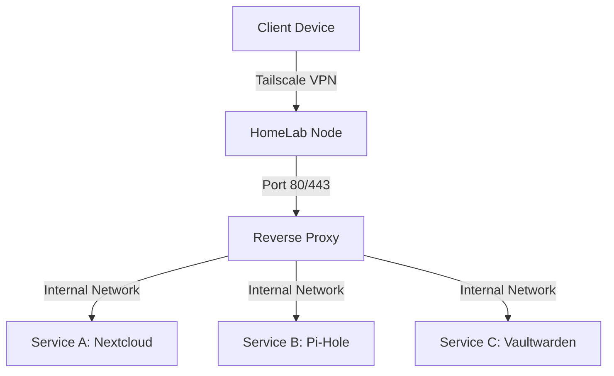

# My Private Mesh-Networked HomeLab


-lightgrey)

## Overview
This repository documents the infrastructure and configuration of my private self-hosted environment. The primary goals of this project are **data sovereignty**, **network security**, and **hands-on learning** of system administration.

The system orchestrates **17+ services** using Docker containers, accessible securely from anywhere via a mesh VPN (Tailscale) without exposing ports to the public internet.

## Architecture
* **Hardware:** [e.g. Raspberry Pi 4 / Intel NUC / Old Laptop]
* **OS:** [e.g. Ubuntu Server 22.04 LTS]
* **Networking:** Tailscale (Mesh VPN) with ACLs.
* **Orchestration:** Docker Compose & Portainer.
* **Reverse Proxy:** [e.g. Nginx Proxy Manager / Traefik]

### Network Logic
Traffic is routed internally using a reverse proxy. Access is restricted to devices authenticated via the Tailscale overlay network.



## Tech Stack & Services

| Category | Service | Function |
| --- | --- | --- |
| **Networking** | **Tailscale** | Zero-trust mesh VPN for remote access. |
| **DNS/Adblock** | **Pi-hole / AdGuard** | Network-wide ad blocking and local DNS resolution. |
| **Proxy** | **Nginx PM** | SSL termination and routing. |
| **Storage** | **Nextcloud** | Private cloud storage and sync. |
| **Security** | **Vaultwarden** | Self-hosted Bitwarden instance for password management. |
| **Monitoring** | **Uptime Kuma** | Service health monitoring. |
| **Automation** | **Watchtower** | Automating Docker container updates. |
| **...** | **...** | ... |

*(List the rest of your 17 services here)*

## Security Measures

1. **No Public Exposure:** No ports are forwarded on the router. All ingress traffic must pass through the VPN tunnel.
2. **Automatic Updates:** Watchtower ensures containers are running the latest security patches.
3. **Firewall:** UFW (Uncomplicated Firewall) configured to deny incoming traffic except via the VPN interface.
4. **Backups:** [Briefly mention how you backup, e.g., "Daily Restic snapshots to external storage"]

## Deployment Strategy

All services are defined as code using `docker-compose.yml` files.

**Example Structure:**

```yaml
version: '3'
services:
  app:
    image: image_name:latest
    restart: unless-stopped
    volumes:
      - ./data:/data
    networks:
      - proxy_net
    environment:
      - PUID=1000
      - PGID=1000

```

## Future Improvements

* [ ] Migration to Kubernetes (k3s) for better scalability.
* [ ] Implementation of Prometheus/Grafana for deeper metrics.
* [ ] Automating the setup via Ansible playbooks.

---

*Note: Sensitive configurations and `.env` files are excluded from this repository for security reasons.*

---
